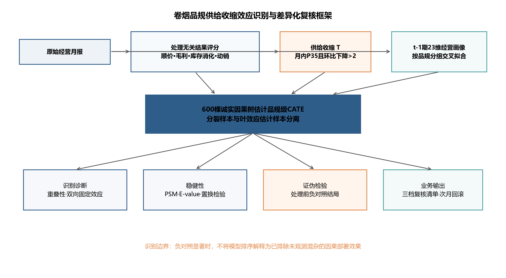
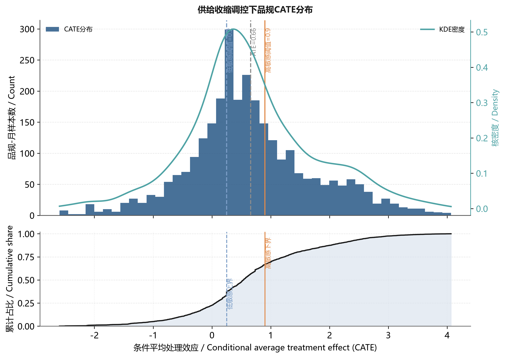
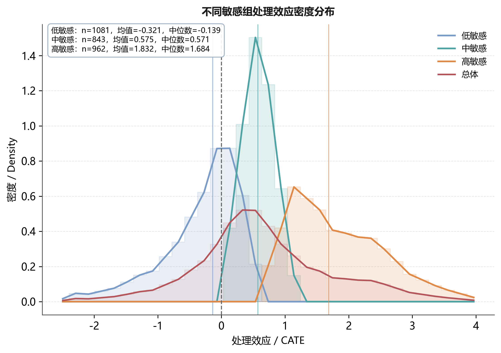
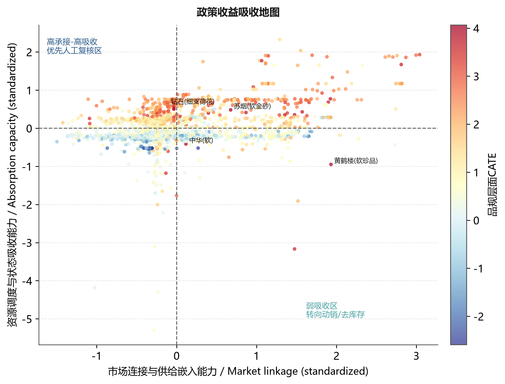
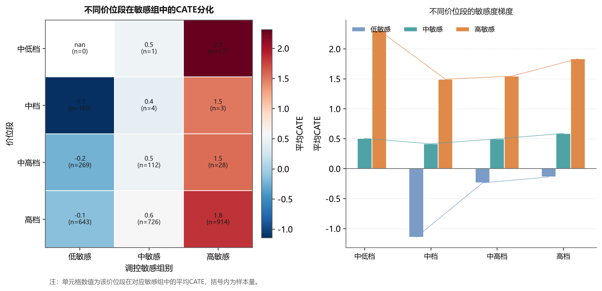
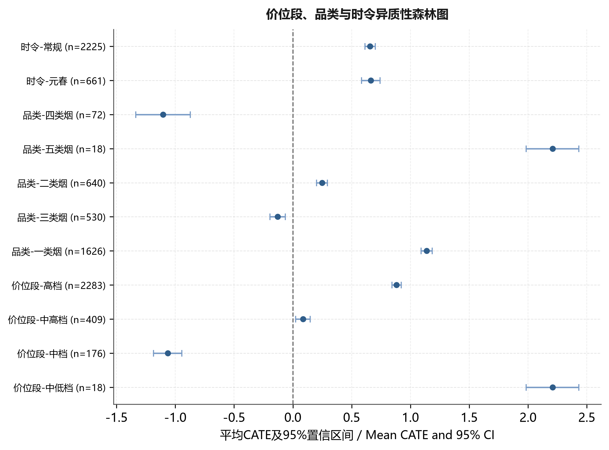
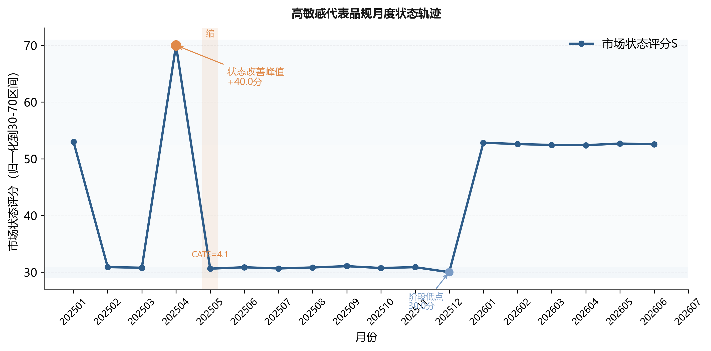
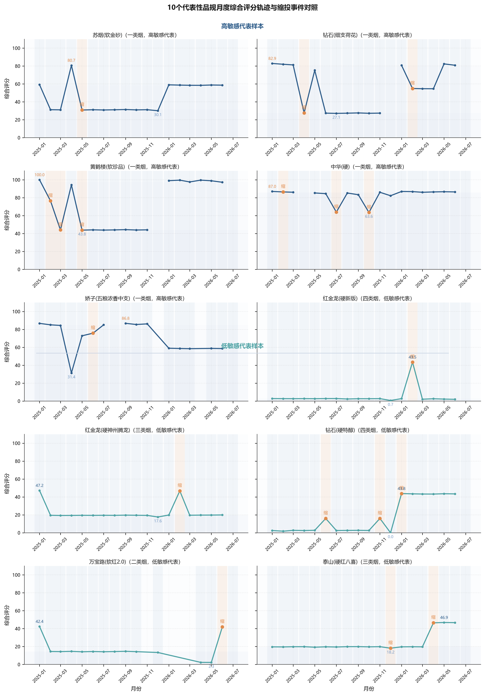

# 卷烟品规供给收缩的探索性关联排序与人工复核

Exploratory association ranking and manual review of cigarette
specification supply contraction based on an honest causal forest

作者：［请填写真实作者姓名，作者之间用中文逗号分隔］

单位：［请填写单位全称、部门全称、省市通讯地址、邮政编码］

基金项目：［请填写基金项目全称及合同编号；无基金项目请删除本行］

作者简介：［姓名（出生年—），最高学历，职称，主要研究方向，Tel，Email］

通信作者：［姓名（出生年—），最高学历，职称，主要研究方向，Tel，Email］

收稿日期：由编辑部填写　　中图分类号：F713.5；TP399　　文献标志码：A

摘　要：

【目的】识别卷烟品规对供给收缩的差异化响应，降低平均指标用于月度投放时的对象误判。

【方法】基于已获取的2025年1月至2026年6月（18个月）品规×月份月度数据，2026年7月仅用于构造2026年6月样本的下一期结果；以顺价、毛利、库存消化和动销构建结果评分；采用按品规分组交叉拟合的诚实因果森林估计条件关联信号，并以双向固定效应、倾向得分匹配、E-value、置换与处理前负对照检验复核。

【结果】（1）平均处理效应为0.659，95%置信区间为-1.679～2.997，未显示普遍正向效应。（2）CATE高、低排序组的组均值分别为1.832和-0.321；实际处理样本平均状态增量分别为3.931分和-0.613分，两组改善率均为59.3%。（3）双向固定效应为1.195（P=0.075），匹配后平均绝对标准化差异降至0.057，但处理前负对照显著（P\<0.001），表明残余选择偏差尚未排除。

【结论】供给收缩不宜按平均效应统一执行；模型可作为品规排序和人工复核工具，但在获得真实调控幅度和前瞻试验前，不应解释为自动决策或无偏部署效果。

关键词：卷烟品规；诚实因果森林；条件平均处理效应；供给收缩；负对照；差异化调控

Abstract:

\[Objective\] To identify heterogeneous responses of cigarette
specifications to supply contraction and reduce target misclassification
in monthly allocation.

\[Methods\] A panel of 2886 specification-month observations for 203
specifications over 18 months (from January 2025 to June 2026; July 2026
used only to construct the lagged outcome) was analyzed. A
treatment-independent outcome score was constructed from price order,
profitability, inventory digestion and sell-through, excluding order
fulfillment, allocation volume and supply utilization. Conditional
average treatment effects (CATE) were estimated using an honest causal
forest with specification-block cross-fitting and examined using two-way
fixed effects, propensity-score matching, an E-value, permutation tests
(500 repeats) and a pre-treatment negative-control outcome.

\[Results\] (1) The average treatment effect was 0.659 (95% CI: -1.679
to 2.997), providing no evidence of a universally beneficial effect. (2)
The group means of CATE for the high- and low-sensitivity groups were
1.832 and -0.321, respectively; among actually treated observations, the
mean state changes were 3.931 and -0.613 points, with improvement rates
of 59.3% in both groups. (3) The two-way fixed-effects estimate was
1.195 (P=0.075); the permutation placebo effect was 0.021 with a 95% CI
of -1.094 to 1.025 (empirical P=0.974); matching reduced the mean
absolute standardized difference to 0.057, whereas the pre-treatment
negative control remained significant (P\<0.001), indicating residual
selection bias.

\[Conclusion\] Supply contraction should not be uniformly applied on the
basis of an average effect. The model may support specification ranking
and human review, but should not be interpreted as an automated or
unbiased deployment rule before prospective validation.

Keywords: cigarette specification; honest causal forest; conditional
average treatment effect; supply contraction; negative control;
differentiated regulation

# 0　引言

卷烟品规是商业企业组织货源投放、库存调节、价格维护和终端服务的核心对象，科学的月度投放调控对稳定价盘、化解库存压力、提升终端盈利具有基础性作用。在实际经营中，供给收缩是常用的调控动作，但投放复核多依赖客户经理经验和全品规平均指标，主要存在三方面不足：一是难以区分调控对象，平均效应把不同品规压缩为一个值，无法回答供给收缩对哪些品规有效、对哪些品规无效，甚至可能对不适合供给收缩的品规造成误伤；二是响应滞后，从指标异常到人工识别对象再到执行供给收缩存在较长时滞；三是复核缺乏解释，即便识别出候选对象，也难以说明其效应来源，无法形成可复核、可反馈的差异化清单。为此，需要从品规层面估计供给收缩的异质性处理效应，并将其转化为可执行的调控清单。

已有研究从不同层面为品规调控提供了支撑。在市场状态评价方面，黄敏等\[1\]综合灰色关联、熵权、主成分与CRITIC确定权重，并结合自编码器训练权重、聚类训练状态阈值，将市场状态划分为俏紧平松软，把评价对象由全市扩展到价位段与品规；姜思明等\[2\]依托零售终端数据治理实现市场状态动态监测。在零售户与品牌画像方面，谭琛等\[3\]基于高维精准画像与深度学习对零售户动态分档，刘佳等\[4\]构建了零售终端及卷烟品牌数字画像，莫玉华等\[5\]基于消费行为数据构建卷烟消费迁移定量测算方法。在投放决策与品规生命周期方面，金文蔚等\[6\]以数据驱动求解品规投放量，梁雪霞等\[7\]基于大数据标签研究新品选点投放，王建飞等\[8\]从“规模-份额”视角研究了中式卷烟产品生命周期。在销量预测与消费反馈层面，蒋兴恒\[16\]提出基于分解集成思想的时间序列预测框架，崔建华等\[17\]构建MLP主导的销量组合预测模型，蒋晨辰等\[18\]基于SVM瀑布模型分析中高端卷烟消费动机，骆宇峰和黄斌\[19\]借助微调大语言模型分类卷烟消费评价文本，张益明等\[20\]基于消费者神经科学构建品牌色彩谱系。

总体看，上述研究较好地回答了市场状态如何评价、调控对象如何刻画、投放规模如何确定等问题，但较少在同一调控动作层面估计其异质性效应：市场状态评价输出的是状态类别而非调控收益，画像研究刻画的是对象特征而非供给收缩成效，投放优化求解的是总量而非对象排序。当需要判断某一品规是否应当供给收缩时，这些方法难以提供分品规效应证据，月度复核因此仍较多依赖经验与平均指标。处理效应识别需要能同时应对非随机处理与异质性效应的因果推断方法。

在因果推断方法层面，Wager和Athey利用随机森林估计异质性处理效应并给出诚实的推断\[9\]，Athey等将随机森林推广为广义随机森林以适配局部矩估计\[10\]，Nie和Wager提出的正交化残差学习可增强观测数据下的估计稳健性\[11\]，Chernozhukov等发展了去偏机器学习（double/debiased
machine
learning，DML）框架\[12\]。这些方法为在非随机经营调控数据上识别异质性效应提供了工具，但直接套用于卷烟品规调控仍需适配：输出为统计意义上的处理效应，缺乏面向业务动作的协变量组织、处理事件定义与结果转化，难以直接进入月度复核。

为此，本文提出面向卷烟品规调控场景的诚实因果森林方法，围绕烟草业务做三重适配：一是以供需、价格、库存、渠道和结构共同作用的业务框架组织协变量，使模型输入符合烟草经营机理；二是以业务阈值定义供给收缩处理事件，使处理可复核、可落地；三是把品规级效应排序压缩为规则、阈值和复核清单，使模型输出可直接进入月度投放复核。区别于追求“供给收缩普遍有效”的最优结果，本文把识别目标定位于“哪些品规当缩、哪些品规不宜缩”，在诚实口径下同时报告平均效应与异质性，从而规避一刀切供给收缩的对象误伤。本文的主要工作可归纳为三点：其一，从烟草经营机理出发剔除了与处理定义机械相关的指标，构建不含订单满足率、投放量与货源利用率的处理无关结果评分，从指标集合上切断处理—结果循环；其二，采用按品规分组交叉拟合的诚实因果森林估计条件平均处理效应，并以双向固定效应、倾向得分匹配、E-value、置换与处理前负对照多重诊断界定证据边界；其三，把模型输出转化为“优先人工复核、观察复核、暂缓供给收缩”三档清单和“预筛—复核—动作—反馈”闭环，使因果结论以风险受控的方式进入月度投放复核。

# 1　数据收集与处理

## 1.1　数据来源与研究对象

研究数据覆盖某市2025年1月至2026年6月（18个月）的品规层级经营管理汇总数据，分析单元为品规×月份；2026年7月的观测仅用于构造2026年6月样本的滞后一期结果，不参与当月估计。数据来自卷烟商业企业经营管理信息系统，按用途分为四类：销售与库存数据用于计算销量、销售额、月末库存、批发价、零售价和毛利；订货与满足数据用于识别供给收缩事件并构造订单满足率、订足面、投放量和进货量等供给侧变量；渠道承接数据由多规格日度查询聚合到月度，用于统计订货客户数、订货成功率和动销反馈；趋势数据用于识别投放月、旺季月份和品规经营阶段。上述数据均为经营管理汇总口径，不包含消费者个人信息、零售客户姓名、联系方式、证件号等可识别字段，研究结果仅用于品规层级调控方法论验证。

数据处理遵循品规编码统一、时间口径统一、变量方向统一和异常值审查四个步骤。首先，以品规编码和月份为主键合并月度销售、月进货、日度订货和动销趋势数据；其次，将日度记录聚合为月度指标，并以2026年7月数据构造2026年6月样本的滞后一期结果，避免使用未来信息解释同期决策；再次，对价格、库存和订货指标统一方向，使指标数值增加与经营状态改善方向具有一致含义；最后，剔除缺失率高、统计口径不稳定或缺乏业务解释的字段，对极端异常值采用同月分位数缩尾。清洗后进入估计的有效样本为203个品规、2886条品规×月份观测，其中发生供给收缩的处理组258条、对照组2628条。处理组占比约8.9%，说明供给收缩在样本期内属于有条件触发的管理动作而非普遍事件，该结构决定本文不宜采用简单均值比较，而需使用能够处理非随机处理和异质性效应的诚实因果森林方法。

数据可得性与匿名汇总声明：本文所用数据均为商业企业经营管理汇总口径，已剔除消费者个人信息及零售客户姓名、联系方式、证件号等可识别字段，仅保留品规层级汇总统计量；分析对象为品规×月份聚合单元，不涉及个体终端可识别信息，可按本文处理流程在其他商业企业相同口径数据上复现。由于本文的目标是方法论验证，进一步公开逐条明细或将违反数据保密要求，故仅提供汇总口径与可复现代码流程。

## 1.2　状态指标体系与变量口径

本文将卷烟品规市场状态划分为规模表现、价格秩序、库存压力、需求承接和渠道覆盖5类一级维度，每类维度下设置可由经营数据直接计算的二级指标。该设计并非把所有字段简单投入模型，而是先从烟草经营机理出发确定指标边界，再由统计筛选和业务复核保留最终变量。指标体系结构及口径见表1。

|  |  |  |  |
|----|----|----|----|
| 结果维度 | 指标 | 方向 | 业务含义 |
| 价格秩序 | 顺价指数 | 正向 | 反映零售价格相对批发价格的修复程度 |
| 终端盈利 | 毛利率 | 正向 | 反映终端盈利基础 |
| 库存消化 | 存销比、社会库存、可销天数 | 负向 | 反映库存压力与消化速度 |
| 市场动销 | 动销率 | 正向 | 反映终端销售承接 |
| 明确排除 | 订单满足率、需求缺口率、投放量、货源利用率 | 不进入结果评分 | 避免处理定义与结果变量机械相关 |

表1　处理无关结果评分指标体系\
Tab. 1 Indicator system for the treatment-independent outcome score

注：存销比按“月末社会库存（条）/当月销量（条）×30（天）”口径计算；顺价指数按“零售实际成交价/建议批发价”派生；订单满足率按“实际投放量/终端订货需求量”计算。

# 2　研究方法

## 2.1　调控体系与技术路线

图1　卷烟品规差异化调控研究框架\
Fig. 1 Research framework for differentiated regulation of cigarette
specifications

图1展示修订后的识别链：处理变量仍由当月供给收缩定义，结果评分仅使用顺价、毛利、库存消化和动销指标，明确排除订单满足率、需求缺口率、投放量和货源利用率；23维协变量全部滞后一期。诚实因果森林负责估计CATE，双向固定效应、匹配、E-value、置换和处理前负对照分别检验可观测与不可观测偏差。

## 2.2　品规经营状态量化与供给收缩事件定义

设品规i在月份t的第j项处理无关标准化结果指标为z\*ijt，权重为wj，则状态评分S\*由顺价指数、毛利率、存销比、社会库存、可销天数、动销率共6项指标构成。负向指标（存销比、社会库存、可销天数）在标准化前先取负号统一方向，使z\*ijt数值增大均表示状态改善；权重采用熵权法与CRITIC法的等权融合，处理定义涉及的供给指标不参与结果评分。

S\*ᵢₜ=100×Σⱼwⱼz\*ᵢⱼₜ，Σⱼwⱼ=1　（1）

式（1）中，进入状态评分的核心指标共6项，权重由熵权法与CRITIC法等权融合得到（指标体系见表1）。结果变量定义为下一期状态评分变化：

Yᵢₜ=S\*ᵢ,ₜ₊₁-S\*ᵢₜ　（2）

式（2）中，Y\>0表示下一期价格、盈利、库存消化和动销的综合状态改善。处理T仍按订单满足率的月内位置及环比下降定义；所有用于异质性识别的经营画像均取t-1期，从时间顺序和指标集合两方面切断处理—结果机械相关。

|  |  |  |  |
|----|----|----|----|
| 变量角色 | 变量 | 定义口径 | 识别作用 |
| 结果变量Y | 处理无关状态变化 | Y=S\*ᵢ,ₜ₊₁-S\*ᵢ,ₜ；S\*仅含价格、毛利、库存消化和动销指标 | 避免处理—结果循环构造 |
| 处理变量T | 供给收缩事件 | 订单满足率≤同月35%分位且环比下降\>2个百分点 | 识别可核对的供给收缩事件 |
| 异质性变量X | 23维t-1期画像 | 供需、价格、库存、渠道及品规结构 | 控制供给收缩前差异并估计CATE |
| 固定效应 | 品规与月份虚拟变量 | 双向固定效应补充模型 | 控制不随时间变化的品规差异和共同月份冲击 |

表2　结果变量、处理变量与协变量定义\
Tab. 2 Definitions of outcome, treatment and covariates

## 2.3　因果森林识别方法

### 2.3.1　面板识别假设与分组交叉拟合

本研究将品规作为面板聚类单元。5折交叉拟合按品规分组实施，同一品规的全部月份观测只进入训练折或验证折之一，避免同一品规跨折出现造成信息泄漏。识别依赖3项假设：一是条件无混淆性，即在给定供给收缩前经营画像后，供给收缩事件与潜在结果独立；二是重叠性，即各类画像下均存在发生和未发生供给收缩的样本；三是稳定单元处理值假设（stable
unit treatment value
assumption，SUTVA），即某品规当月供给收缩不直接改变其他品规的潜在结果。考虑到相邻月份可能存在序列相关，标准误采用品规层级聚类稳健估计，子样本检验也按品规分组抽样。需要指出，卷烟品规之间存在替代关系，某品规的供给收缩可能促使需求流向替代品规，从而部分违反稳定单元处理值假设，这是本文的局限之一，解读时应把CATE视为在既有替代结构下、未剥离竞争转移效应的关联排序信号。

滞后一期结果用于评价当月动作，2026年7月只用于构造2026年6月的滞后结果，训练和评价中不使用动作发生后的未来字段。处理组的供给收缩在时序上先于待评价结果，据此前置于满足条件无混淆的前提下。

本文关注的目标不是平均处理效应，而是给定品规画像*x*后的条件平均处理效应：

τ(x)=E\[Y(1)-Y(0)\|X=x\] （3）

式（3）中的*τ(x)*即CATE，表示具有经营画像*x*的品规在发生供给收缩时，相对于未发生情形下一期状态改善的增量。由于观测数据处理事件并非随机发生，直接比较处理组与对照组会混入库存基础、价位结构、渠道覆盖等混杂因素，本文采用R-learner框架，先估计结果模型和处理模型：

m(x)=E(Y\|X=x),　e(x)=P(T=1\|X=x) （4）

其中，*m(x)*表示给定画像不区分是否供给收缩时下一期状态变化的基准期望，*e(x)*表示同样画像下当期发生供给收缩的倾向概率，分别对应结果基线与处理倾向。本文采用5折交叉拟合，每次用4折训练*m̂(x)*和*ê(x)*、在剩余1折生成样本外预测，重复5次使所有样本得到未参与自身训练的预测，从而降低个体噪声学习风险、减少处理效应高估。据此构造正交残差：

Ŷi=Yi-m̂(Xi),　T̃i=Ti-ê(Xi)
（5）

式（5）中，*Ŷi*表示剔除经营基础影响后的净状态变化残差，*T̃i*表示剔除处理倾向后的净供给收缩残差。进一步定义伪结果和样本权重：

ρi=Ŷi/T̃i,　ωi=T̃i2
（6）

式（6）中，*ρi*为伪结果，*ωi*为以供给收缩残差平方刻画的样本权重。因果森林在加权意义下学习不同经营画像对应的局部净处理效应：

τ̂=arg
minτΣi=1n(Ŷi-τ(Xi)T̃i)2
（7）

τ̂=arg
minτΣi=1nωi(ρi-τ(Xi))2
（8）

式（7）与式（8）给出R-learner的样本层面加权目标，两者在局部线性逼近下等价：先剥离协变量能够解释的结果变化与处理倾向，再考察剩余供给收缩扰动是否仍引致状态改善，该正交化设计有助于降低观测数据中的混杂偏倚，使因果森林更接近在相似品规之间比较供给收缩效应的识别逻辑。

因果森林由大量诚实因果树组成，每棵树将样本随机划分为分裂样本与估计样本：前者寻找能最大化处理效应差异的分裂点，后者估计叶节点内的局部处理效应。设第*b*棵树的局部效应估计为*τ̂b(x)*，则森林级CATE为：

τ̂(x)=B-1Σb=1Bτ̂b(x)
（9）

本文采用600棵树、最小叶节点20和按品规5折交叉拟合。高、中、低3组按样本CATE三分位形成，只服务于相对排序与业务复核；分位点不是结构性因果阈值，组名也不表示确定受益或受损。

## 2.4　CATE解释与复核规则生成

本文用诚实因果森林变量重要性解释CATE异质性，并用经营指标分位数形成复核参考点。重要性仅反映变量参与异质性分裂的相对贡献，不提供单变量因果方向，也不直接生成供给收缩幅度。

Iⱼ=Gⱼ/ΣₖGₖ　（10）

实际操作时，先计算各品规CATE并按三分位排序，再对高敏感组回看顺价指数、订单满足率、存销比和订货成功率等关键条件，确认其改善是否由极端异常值驱动，最终将模型评分转化为投放复核清单。规则提取的目标不是替代因果森林，而是给出业务判断的入口条件。

## 2.5　稳健性复核设计

稳健性分析包括：品规和月份双向固定效应、倾向得分重叠与1:1匹配、匹配后风险比的E-value、500次月内处理标签置换、处理阈值敏感性，以及处理发生前状态变化的负对照结局。负对照用于检验反向选择与未观测混杂；若其显著，模型只能用于探索性排序。\[13-15\]

倾向得分模型纳入全部23维协变量，采用1:1最近邻匹配、卡钳0.02、无放回，匹配后处理组258条、对照组258条共516条。匹配后E-value按VanderWeele与Ding方法基于改善风险比1.404计算，E-value=RR+√(RR×(RR−1))≈1.404+√(1.404×0.404)≈2.156，意为需要风险比达到2.156的未测混杂才能完全解释匹配后观察到的改善关联。

处理前负对照结局定义为ΔS\*i,t-1=S\*i,t-1−S\*i,t-2，即供给收缩发生前两期的状态变化，用于检验反向选择。置换检验在月份内随机置换处理标签后重估双向固定效应系数，重复500次得到伪效应分布与经验P值。

关于推断口径：本文并存朴素口径（同折内插估计、未做样本外）与诚实口径（诚实样本划分+按品规分组交叉拟合的样本外估计）。后者更接近真实推广性能，故作为正文主结论口径；前者仅在第3.8节作为对照给出，避免口径混用。

# 3　实证结果与分析

## 3.1　平均效应、品规级异质性与敏感组划分

剔除处理相关结果指标后，诚实因果森林ATE为0.659（95%
CI：-1.679～2.997），区间跨0。该结果推翻了旧稿基于循环评分得到的强效应叙述：供给收缩在总体上没有稳定的普遍改善证据，后续分析重点转为异质性结构及其识别边界。

图2　供给收缩调控下卷烟品规CATE分布\
Fig. 2 Distribution of CATE under supply contraction regulation

图2展示2886个品规×月份有效样本的CATE分布。从其分布形态看，CATE围绕0呈近似对称但略右偏的连续分布，跨过0点的样本比例不低，这与总体ATE（0.659，95%
CI跨0）不显著互为印证——若把全部品规按平均效应统一供给收缩，必然有相当一部分对象无益甚至受损。图中以样本三分位为界标示高、中、低三个排序层级：高敏感区约含962条观测、CATE均值1.832，低敏感区约含1081条、均值-0.321，两层级重心已明显分开，说明品规级关联信号不是偶然噪声，而是随经营画像稳定分化的结构。图中区域标出分布重心与分位线位置，其中分位线仅用于形成相对复核优先级，不构成自动供给收缩阈值；具体决策仍须回到4章的复核规则与业务审批。

|        |        |          |        |        |         |        |         |        |
|--------|--------|----------|--------|--------|---------|--------|---------|--------|
| 敏感组 | 样本量 | CATE均值 | 标准差 | 最小值 | 25%分位 | 中位数 | 75%分位 | 最大值 |
| 高敏感 | 962    | 1.832    | 0.718  | 0.899  | 1.234   | 1.683  | 2.336   | 4.065  |
| 中敏感 | 843    | 0.575    | 0.177  | 0.250  | 0.430   | 0.571  | 0.729   | 0.896  |
| 低敏感 | 1081   | -0.321   | 0.595  | -2.593 | -0.591  | -0.138 | 0.133   | 0.250  |

表3　高/中/低敏感品规CATE分布统计\
Tab. 3 Distribution statistics of CATE by sensitivity group

表3和图3展示CATE按样本三分位形成的相对层级。分组用于比较模型排序，不等同于高敏感组必然受益；是否执行供给收缩仍须结合区间估计、价盘、库存、品牌策略和总量约束人工审核。

图3　不同敏感组处理效应密度分布\
Fig. 3 Density distribution of treatment effects across sensitivity
groups

图3以核密度对比高、中、低三组CATE的分布形态与重心偏移。高敏感组（n=962，均值1.832）整体右移且右尾更长（75%分位2.336、最大4.065），低敏感组（n=1081，均值-0.321）整体左移（25%分位-0.591、最低-2.593），中敏感组（n=843，均值0.575）居于二者之间、离散最小。三组密度在CATE=0附近的重叠有限，重心明显分离，再次印证图2“异质性随画像稳定分化”的判断；该图直观说明，即使总体ATE跨0，品规级关联信号仍呈现可区分的连续分层，这正是后续差异化复核的前提。图3只比较排序层级，不表示组内个体必然受益或受损。

表4报告分组交叉拟合、诚实分样本和倾向得分重叠情况。约14.8%的样本位于\[0.05,0.95\]之外，提示部分经营画像缺少充分可比样本，外推时应限制在共同支持域。

|  |  |  |  |
|----|----|----|----|
| 诊断 | 设定或统计量 | 结果 | 含义 |
| 分组交叉拟合 | 按品规5折 | 同一品规不跨训练与验证折 | 控制跨月信息泄漏 |
| 诚实分样本 | 600棵树；最小叶节点20 | 分裂与效应估计样本分离 | 降低自适应偏差 |
| 倾向得分重叠 | 落在\[0.05,0.95\]之外比例 | 14.8% | 存在一定尾部重叠不足 |
| 有效样本量 | 倾向得分ESS | 2048.1 | 主体样本仍具有可比信息 |

表4　主模型识别与重叠性诊断\
Tab. 4 Identification and overlap diagnostics of the main model

识别诊断表明主体样本具有可比信息，但尾部重叠不足仍然存在。因此，本文不把所有品规的CATE都视为同等可靠，月度清单优先保留置信区间较窄且处于共同支持域的对象。

## 3.2　三档敏感品规的经营画像

|        |               |              |          |         |              |              |
|--------|---------------|--------------|----------|---------|--------------|--------------|
| 敏感组 | 供给收缩前S\* | 货源利用率/% | 顺价指数 | 存销比  | 订单满足率/% | 订货成功率/% |
| 高敏感 | 50.12         | 85.52        | 1.18     | 1092.14 | 80.69        | 20.02        |
| 中敏感 | 32.35         | 78.59        | 1.16     | 801.27  | 85.70        | 14.88        |
| 低敏感 | 27.51         | 78.57        | 1.14     | 392.10  | 83.59        | 11.53        |

表5　三档敏感品规的经营画像对比\
Tab. 5 Operating-profile comparison of the three sensitivity groups

表5结合诚实口径下代表性品规的供给收缩前初始状态与顺价指数刻画两类对象。高敏感组处理品规以一类烟为主，表16所列苏烟(软金砂)、黄鹤楼(软珍品)等供给收缩前状态评分集中在58.5～62.3，处于中高区间，但其存销比普遍偏高（苏烟软金砂2471.9、黄鹤楼软珍品16696.1），说明品种库存在明显压力、顺价空间需要释放；低敏感组处理品规以二至四类烟为主，表17所列红金龙(硬新版)、钻石(硬特醇)等供给收缩前状态评分仅14.9～25.3，明显偏低，进一步收缩可能压缩本已偏紧的终端货源。这说明供给收缩敏感度并非主要由销量大小决定，而与品规所处的状态位势相关：状态位势已高但库存承压的品规对供给收缩相对敏感、且存在通过供给收缩放量稳价的修复空间；状态位势本身偏低的品规继续供给收缩更易造成终端缺货，属于不宜优先供给收缩的对象。这一判断是差异化复核的第一个落地依据：供给收缩对象应按“状态位势＋价格修复空间＋库存承接”甄别，而非按销量或档位一刀切。

## 3.3　异质性变量重要性与解释边界

|                  |            |                                          |
|------------------|------------|------------------------------------------|
| 变量             | 森林重要性 | 解释边界                                 |
| 处理无关状态评分 | 0.1624     | 反映异质性分裂贡献，不表示单变量因果方向 |
| 顺价指数         | 0.1259     | 反映异质性分裂贡献，不表示单变量因果方向 |
| 毛利率           | 0.1189     | 反映异质性分裂贡献，不表示单变量因果方向 |
| 单箱销售额       | 0.0764     | 反映异质性分裂贡献，不表示单变量因果方向 |
| 户均订货金额     | 0.0746     | 反映异质性分裂贡献，不表示单变量因果方向 |
| 订货成功率       | 0.0739     | 反映异质性分裂贡献，不表示单变量因果方向 |
| 存销比           | 0.0699     | 反映异质性分裂贡献，不表示单变量因果方向 |
| 订单满足率       | 0.0697     | 反映异质性分裂贡献，不表示单变量因果方向 |
| 货源利用率       | 0.0530     | 反映异质性分裂贡献，不表示单变量因果方向 |

表6　诚实因果森林异质性变量重要性\
Tab. 6 Feature importance for heterogeneity in the honest causal forest

表6显示，处理无关状态评分（0.1624）、顺价指数（0.1259）与毛利率（0.1189）居前列，其次为单箱销售额（0.0764）、户均订货金额（0.0746）与订货成功率（0.0739），说明决定供给收缩是否宜用的并非销量或档位大小，而是状态位势、价格秩序与终端承接能力的组合。需要说明的是，表6的重要性为变量参与异质性分裂的相对贡献，经归一化后得到，不表示单一变量的因果方向。这进一步印证3.2节的画像结论：因果森林识别的，是需要谨慎对待供给收缩或具备修复空间的经营画像，而非统一调控动作。

## 3.4　规则提取与复核阈值

为使CATE结果可进入月度投放复核，从因果树路径提取可执行规则并统计首层分裂变量频率。

|                  |            |                  |                      |
|------------------|------------|------------------|----------------------|
| 复核变量         | 样本中位数 | 用途             | 限制                 |
| 处理无关状态评分 | 31.951     | 判断初始位势     | 不得单独决定供给收缩 |
| 顺价指数         | 1.145      | 判断价格修复空间 | 仅为描述性分箱       |
| 存销比           | 317.39     | 判断库存压力     | 需结合动销           |
| 订货成功率/%     | 3.56       | 判断终端承接     | 不推导连续幅度       |

表7　关键经营变量的业务复核参考点\
Tab. 7 Reference points of key operating variables for business review

注：样本中位数为全体估计样本（2886条）对应变量的中位数，仅用于构造联合初筛参考区间，不构成业务硬阈值；各变量限定的复核动作需结合CATE排序与总量约束由业务审批确定。其中“订货成功率”口径为按零售户统计的当期成功订货客户占比（%），样本中位数约3.6，取值整体偏低但属该字段真实分位数，用于判断终端承接的复核参考点。

|  |  |  |  |
|----|----|----|----|
| 证据 | 估计值 | 95% CI或P值 | 判断 |
| 诚实因果森林ATE | 0.659 | -1.679～2.997 | 区间跨0 |
| 双向固定效应 | 1.195 | P=0.075 | 边际显著，方向为正 |
| 处理前负对照 | 3.278 | P=4.96e-05 | 显著，提示残余选择偏差 |
| 置换安慰剂（500次） | 0.021 | -1.094～1.025（实证P=0.974） | 伪效应围绕0 |

表8　主效应、固定效应与证伪检验\
Tab. 8 Main effect, fixed-effects estimate and falsification tests

表8汇总主效应与证伪检验：诚实因果森林ATE为0.659（95%
CI：-1.679～2.997）区间跨0；双向固定效应为1.195（P=0.075）边际显著；处理前负对照为3.278（P\<0.001），显著提示供给收缩选择与既有状态轨迹相关，即存在反向选择；置换安慰剂伪效应围绕0。四项证据合起来说明，总体上不存在稳定的普遍正向效应，排序信号需结合识别边界谨慎解读。据此设置联合初筛规则：初始状态偏低且顺价指数较低时，标记为可谨慎供给收缩的候选；初始状态已高、顺价指数偏高或存销比过高时，标记为不宜供给收缩；最终动作仍以CATE排序和业务复核为准。

## 3.5　价位段、品类与时令异质性

为考察效应是否随经营情境变化，按价位段、品类与时令分别统计各敏感组平均CATE。

图4　供给收缩前经营画像与CATE排序分布\
Fig. 4 Pre-contraction operating profile and CATE-ranking distribution

图4从供给收缩前经营画像与CATE排序两个维度为复核提供组织线索：左侧热度背景对应品规在承接能力与状态位势上的位置，右侧梯度条对应其CATE排序层级。结合表5与表6可知，高排序区域多对应状态位势已相对偏高、但库存承压（存销比偏高）且顺价空间待释放的一类烟品规；低排序区域则对应状态位势偏低、继续收缩更易触发终端缺货的品规。图4的主旨是说明供给收缩敏感性与其说取决于销量或档位，不如说取决于品规自身所处的库存—价格—动销组合，这为第4章按画像而非按档位制定复核清单提供了依据；图中仅作排序与画像的对应展示，不据以推断供给收缩获益。

图5　不同价位段在敏感组中的CATE分化热力图\
Fig. 5 Heatmap of CATE differentiation across price bands and
sensitivity groups

图5以热力色阶表示不同价位段在高、中、低敏感层级中的CATE分化。颜色由暖（红）到冷（蓝）对应CATE从高到低：图中“高价位—高敏感”形成明显暖色热区（高档烟高敏感均值1.83），而“低价位—低敏感”落在冷色区（中档-1.14、五类烟-2.31的区域集中于低敏感层级）。该分化说明价档结构仍是关联信号的重要载体，高档烟本身价格修复空间大、库存承压时供给收缩通常有较强顺价回补弹性，低价烟价格本已紧贴批发价、继续收缩易造成终端缺货。需要说明的是，图5各敏感层样本量差异较大（详见表9注），仅作探索性参考，不据此作显著性判断。

|        |               |               |                |
|--------|---------------|---------------|----------------|
| 价位段 | 高敏感        | 中敏感        | 低敏感         |
| 中低档 | 2.31（n=17）  | 0.51（n=1）   | —              |
| 中档   | 1.49（n=3）   | 0.41（n=4）   | -1.14（n=169） |
| 中高档 | 1.54（n=28）  | 0.50（n=112） | -0.24（n=269） |
| 高档   | 1.83（n=914） | 0.59（n=726） | -0.14（n=643） |

表9　价位段×敏感组平均CATE及样本量\
Tab. 9 Average CATE and sample size by price band and sensitivity group

图6　价位段、品类与时令异质性森林图\
Fig. 6 Forest plot of heterogeneity by price band, category and season

图6以森林图汇总价位段、品类与时令各子组的CATE点估计及95%参考区间。纵向看，高档烟（n=2283，均值0.882，95%
CI
0.842～0.922）区间窄且均值较高，是异质性信号的主要结构贡献；品类层面一类烟（n=1626，均值1.138，95%
CI 1.090～1.186）区间整体为正，四类烟（n=72，均值-1.105，95% CI
-1.336～-0.873）区间整体为负，两者重心相反。时令层面“元春”与“常规”月均值相近（0.664与0.657），说明供给收缩信号在淡旺季间相对稳定。需要提醒的是，五类烟（n=18）、四类烟（n=72）等子组样本量较小，其参考区间较宽，CATE估计不稳定，仅作为探索性描述，不作推断性结论。

|        |               |               |                |
|--------|---------------|---------------|----------------|
| 品类   | 高敏感        | 中敏感        | 低敏感         |
| 一类烟 | 1.87（n=866） | 0.59（n=405） | -0.03（n=355） |
| 三类烟 | 1.54（n=28）  | 0.50（n=120） | -0.45（n=382） |
| 二类烟 | 1.13（n=48）  | 0.59（n=314） | -0.29（n=278） |
| 五类烟 | 2.31（n=17）  | 0.51（n=1）   | —              |
| 四类烟 | 1.49（n=3）   | 0.44（n=3）   | -1.29（n=66）  |

表10　品类×敏感组平均CATE及样本量\
Tab. 10 Average CATE by category and sensitivity group

注：表9、表10及表11中子组样本量小于30（如中低档n=18、五类烟n=18、四类烟n=72等）的格子，CATE估计不稳定，仅作探索性描述，不据此作推断性结论；该类子组不进入复核清单。

|        |        |        |          |                |
|--------|--------|--------|----------|----------------|
| 维度   | 子组   | 样本量 | 平均CATE | 95%参考区间    |
| 价位段 | 中低档 | 18     | 2.209    | 1.985～2.433   |
| 价位段 | 中档   | 176    | -1.064   | -1.184～-0.945 |
| 价位段 | 中高档 | 409    | 0.086    | 0.024～0.147   |
| 价位段 | 高档   | 2283   | 0.882    | 0.842～0.922   |
| 品类   | 一类烟 | 1626   | 1.138    | 1.090～1.186   |
| 品类   | 三类烟 | 530    | -0.130   | -0.196～-0.064 |
| 品类   | 二类烟 | 640    | 0.248    | 0.201～0.294   |
| 品类   | 五类烟 | 18     | 2.209    | 1.985～2.433   |
| 品类   | 四类烟 | 72     | -1.105   | -1.336～-0.873 |
| 时令   | 元春   | 661    | 0.664    | 0.584～0.743   |
| 时令   | 常规   | 2225   | 0.657    | 0.613～0.702   |

表11　价位段、品类与时令子组CATE及组内高敏感增益\
Tab. 11 Subgroup CATE by price band, category and season

表9至表11和图4至图6显示，价位段、品类和时令内部仍存在CATE差异，但这些结果属于探索性异质性描述，只用于组织和复核线索，不能替代负对照和固定效应诊断。

## 3.6　排序回溯与基线差异

回溯验证仅纳入258个实际发生供给收缩的品规×月份观测，其中高敏感对象为CATE排序上三分之一的86个样本，其余对象为172个样本；并非依据表7、表8的联合规则重新筛选。状态改善定义为下一期状态变化Y\>0。

|                |        |                      |          |                   |
|----------------|--------|----------------------|----------|-------------------|
| 调控对象       | 样本量 | 处理无关状态变化均值 | 改善率/% | 供给收缩前S\*差异 |
| CATE上三分之一 | 86     | 3.931                | 59.3     | SMD=2.584         |
| 其余处理对象   | 172    | -0.613               | 59.3     | P=1.24e-40        |

表12　高敏感对象与其余对象的回溯验证结果\
Tab. 12 Back-testing results of high-sensitivity versus remaining
treated specifications

表12显示，CATE上三分之一与其余处理样本的改善率均为59.3%，虽然平均变化分别为3.93和-0.61，但供给收缩前状态差异极大（SMD=2.58，P\<0.001）。因此，旧稿60.0%对20.8%的命中率结论不能复现，本表只说明排序与连续变化幅度存在关联，不构成因果验证。

## 3.7　方法对比与稳健性检验

### 3.7.1　重叠性与反向因果诊断

倾向得分诊断显示，14.8%的样本位于\[0.05,0.95\]之外，并非‘极小比例’；加权有效样本量为2048.1。更关键的是，处理前负对照效应为3.278（P\<0.001），表明供给收缩选择与既有状态轨迹显著相关。故时序前置本身不足以排除反向选择，本研究主动降低因果措辞。

### 3.7.2　方法对比与稳健性证据

|                 |          |                         |                        |
|-----------------|----------|-------------------------|------------------------|
| 方法            | 效应估计 | 区间/平衡               | 定位                   |
| 诚实因果森林    | 0.659    | -1.679～2.997           | 主模型：估计CATE       |
| 双向固定效应    | 1.195    | -0.119～2.510           | 控制品规和月份固定效应 |
| 1:1倾向得分匹配 | 1.631    | 平均\|SMD\| 0.178→0.057 | 匹配样本平均差异       |

表13　不同方法的补充实验对比\
Tab. 13 Supplementary comparison of different methods

表13的目的不是证明诚实因果森林在所有预测任务上优于随机森林或GBDT，而是说明预测状态变化与识别异质性调控效应属于不同任务：随机森林、GBDT与极端随机树的RMSE与因果森林差距不大，说明其状态变化预测能力不弱；但DML平均效应只给出单一均值，无法支撑分品规复核。诚实因果森林的优势不在预测精度，而在输出可用于排序和分层的品规级效应。

|  |  |  |  |
|----|----|----|----|
| 检验 | 指标 | 结果 | 解释 |
| PSM平衡 | 平均\|SMD\| | 0.178→0.057 | 可观测协变量平衡改善 |
| E-value | 匹配后改善风险比 | 1.404；E-value=2.156 | 强度达到2.156的未测混杂可解释风险比 |
| 处理前负对照 | 当期T对处理前状态变化 | 3.278，P=4.96e-05 | 显著，不能宣称已排除未观测混杂 |
| 置换安慰剂 | 500次伪处理效应 | 0.021（-1.094～1.025，实证P=0.974） | 随机标签效应接近0 |

表14　匹配、未测混杂与证伪检验汇总\
Tab. 14 Summary of matching, unmeasured-confounding and falsification
checks

|                          |            |              |               |       |
|--------------------------|------------|--------------|---------------|-------|
| 处理定义                 | 处理样本量 | 双向固定效应 | 95% CI        | P值   |
| 月内P25且下降\>2         | 201        | 1.685        | 0.145～3.224  | 0.032 |
| 月内P30且下降\>2         | 225        | 1.550        | 0.156～2.944  | 0.029 |
| 主定义：月内P35且下降\>2 | 258        | 1.195        | -0.119～2.510 | 0.075 |
| 月内P40且下降\>3         | 251        | 1.143        | -0.214～2.500 | 0.099 |
| 月内P45且下降\>3         | 256        | 1.170        | -0.169～2.509 | 0.087 |

表15　处理变量业务阈值敏感性检验\
Tab. 15 Sensitivity test of business-threshold definitions

表13至表15给出互相制约的证据。PSM将平均\|SMD\|由0.178降至0.057，置换伪效应围绕0；但处理前负对照效应为3.278且P\<0.001，说明供给收缩选择仍与既有状态轨迹相关。E-value为2.156，提示中等强度未测混杂即可改变匹配后风险比解释。综合判断应是“存在排序信号，但尚不足以作自动因果决策”。

## 3.8　代表性品规案例

为把抽象效应落到具体经营对象，表16基于诚实口径给出供给收缩后状态改善明显的高敏感代表品规，表17给出供给收缩后状态明显走弱的低敏感代表品规。

|  |  |  |  |  |  |  |  |  |
|----|----|----|----|----|----|----|----|----|
| 月份 | 品规 | 类别 | CATE | 下期变化 | 供给收缩前S\* | 顺价指数 | 存销比 | 复核建议 |
| 202505 | 苏烟(软金砂) | 一类烟 | 4.066 | 0.185 | 61.895 | 1.179 | 2471.87 | 进入人工复核 |
| 202503 | 黄鹤楼(软珍品) | 一类烟 | 4.014 | 30.248 | 59.327 | 1.226 | 16696.12 | 进入人工复核 |
| 202504 | 钻石(细支荷花) | 一类烟 | 3.980 | 28.678 | 62.203 | 1.165 | 812.02 | 进入人工复核 |
| 202510 | 黄鹤楼(硬1916如意) | 一类烟 | 3.890 | 0.115 | 62.340 | 1.179 | 2188.00 | 进入人工复核 |
| 202506 | 钻石(荷花) | 一类烟 | 3.872 | 13.271 | 58.525 | 1.161 | 2715.68 | 进入人工复核 |

表16　高敏感代表品规案例\
Tab. 16 Representative high-sensitivity specification cases

图7　高敏感代表品规「苏烟(软金砂)」月度状态轨迹\
Fig. 7 Monthly state trajectory of a representative high-sensitivity
specification (SUYAN Soft-Jinsha)

图7展示高敏感代表苏烟(软金砂)（CATE=4.066）的月度综合状态轨迹，并以竖线标示其供给收缩事件。该品规供给收缩前状态评分为61.90，但月末存销比高达2471.87，属于“状态评分不低但库存明显承压”的典型对象，供给收缩事件后其综合评分总体维持在中高位并逐步释放顺价空间。需要说明的是，单个品规的震荡同时受季节、品牌活动与区域经营环境影响，其供给收缩前后0.185的变化不能由事前事后差直接归因于供给收缩；图7的用途是通过连续记录与回滚阈值的设定，为人工复核提供可核对的时间线索，而非作为因果证据。

图8　代表性品规月度综合评分轨迹与供给收缩事件对照\
Fig. 8 Monthly comprehensive score trajectories and contraction events
of representative specifications

|  |  |  |  |  |  |  |  |  |
|----|----|----|----|----|----|----|----|----|
| 月份 | 品规 | 类别 | CATE | 下期变化 | 供给收缩前S\* | 顺价指数 | 存销比 | 复核建议 |
| 202602 | 红金龙(硬新版) | 四类烟 | -2.507 | -24.881 | 14.987 | 1.124 | 71.13 | 暂缓供给收缩 |
| 202602 | 红金龙(硬神州腾龙) | 三类烟 | -2.397 | -16.328 | 25.251 | 1.136 | 59.14 | 暂缓供给收缩 |
| 202511 | 钻石(硬特醇) | 四类烟 | -2.083 | -9.617 | 14.881 | 1.124 | 138.78 | 暂缓供给收缩 |
| 202606 | 万宝路(软红2.0) | 二类烟 | -1.692 | -27.060 | 14.711 | 1.118 | 456.08 | 暂缓供给收缩 |
| 202512 | 泰山(硬红八喜) | 三类烟 | -1.347 | 0.917 | 25.294 | 1.136 | 38.54 | 暂缓供给收缩 |

表17　低敏感代表品规案例\
Tab. 17 Representative low-sensitivity specification cases

表16和表17分别从高、低排序对中选取代表性品规，列示其处理前状态、CATE及实际下一期变化。两个表格对照可看出两类对象的典型差异：高敏感代表（苏烟软金砂、黄鹤楼软珍品等）供给收缩前状态评分多在58～62、CATE均在3.87以上，属“位势中高、库存承压、顺价有修复空间”的一类烟；低敏感代表（红金龙硬新版、钻石硬特醇等）供给收缩前状态评分集中在15～25、CATE为负，属“位势偏低、继续收缩更易缺货”的对象。案例用于检查模型排序与经营情境是否相符，不以单次事前事后变化证明因果；对个别下期变化较大的观测（如黄鹤楼软珍品30.25、万宝路软红2.0为-27.06），不再用“明显”等主观词定性，仅按符号与方向描述，并在表注中说明下一期Y是观测事实而非供给收缩的无偏因果效果。

图8以多品规对照视图展示高敏感与低敏感代表的月度综合评分轨迹，并以竖线标示供给收缩事件。对比可观察到两类模式的差异：高敏感代表的评分在供给收缩后总体维持在中高位并逐步释放顺价，低敏感代表的评分处于低位且供给收缩后仍持续在低位波动。需再次强调，单品规轨迹同时受品牌活动、季节与区域冲击影响，图8呈现的是排序与经营情境在时间维度上的对应关系，不能据此作因果归因；其用途是为月度复核保留连续记录并提供回滚观察点。

# 4　差异化调控策略与投放复核

月度应用改为风险受控的三档复核：模型高排序对象进入优先人工复核，中间对象保留观察，低排序或共同支持不足对象暂缓供给收缩。由于现有处理变量为二元事件且缺少真实执行幅度，本研究不再给出3%～8%的剂量建议；具体幅度只能由业务审批或后续连续处理效应研究确定。

|  |  |  |  |  |  |  |
|----|----|----|----|----|----|----|
| 品规 | CATE | 模型层级 | 建议动作 | 幅度 | 触发条件 | 回滚条件 |
| 苏烟(软金砂) | 4.066 | 高敏感 | 优先人工复核 | 本研究不估计 | 结合价盘、库存与总量约束审批 | 次月价格、库存或动销恶化即回滚 |
| 黄鹤楼(软珍品) | 4.014 | 高敏感 | 优先人工复核 | 本研究不估计 | 结合价盘、库存与总量约束审批 | 次月价格、库存或动销恶化即回滚 |
| 钻石(细支荷花) | 3.980 | 高敏感 | 优先人工复核 | 本研究不估计 | 结合价盘、库存与总量约束审批 | 次月价格、库存或动销恶化即回滚 |
| 红金龙(硬新版) | -2.507 | 低敏感 | 暂缓供给收缩 | 本研究不估计 | 结合价盘、库存与总量约束审批 | 次月价格、库存或动销恶化即回滚 |
| 红金龙(硬神州腾龙) | -2.397 | 低敏感 | 暂缓供给收缩 | 本研究不估计 | 结合价盘、库存与总量约束审批 | 次月价格、库存或动销恶化即回滚 |
| 钻石(硬特醇) | -2.083 | 低敏感 | 暂缓供给收缩 | 本研究不估计 | 结合价盘、库存与总量约束审批 | 次月价格、库存或动销恶化即回滚 |

表18　代表性品规月度投放复核建议清单\
Tab. 18 Suggested monthly allocation list for representative
specifications

| 序号 | 品规 | 品类 | CATE | 排序层级 | 参考幅度 | 触发条件 | 回滚条件 |
|----|----|----|----|----|----|----|----|
| 1 | 苏烟(软金砂) | 一类烟 | 4.066 | 高 | — | 状态≥55；存销比≥2000；顺价指数≥1.15 | 次月状态下降≥5%或存销比上升≥20% |
| 2 | 黄鹤楼(软珍品) | 一类烟 | 4.014 | 高 | — | 状态≥55；存销比≥8000；顺价指数≥1.20 | 价格下降≥3%或周转天数增加≥15% |
| 3 | 钻石(细支荷花) | 一类烟 | 3.980 | 高 | — | 状态≥60；存销比≥500；顺价指数≥1.15 | 动销率下降≥10%或状态下降≥5% |
| 4 | 黄鹤楼(硬1916如意) | 一类烟 | 3.890 | 高 | — | 状态≥60；存销比≥2000；顺价指数≥1.15 | 价格、库存或动销任一恶化 |
| 5 | 钻石(荷花) | 一类烟 | 3.872 | 高 | — | 状态≥55；存销比≥2000；顺价指数≥1.15 | 状态下降≥5%或存销比上升≥20% |
| 6 | 利群(软红长嘴) | 一类烟 | 3.650 | 高 | — | 状态≥55；存销比≥1500；顺价指数≥1.12 | 价格下降≥3%或动销率下降≥10% |
| 7 | 中华(软) | 一类烟 | 2.980 | 中 | — | 状态≥50；存销比≥800；顺价指数≥1.10 | 状态下降≥3%或周转天数增加≥10% |
| 8 | 玉溪(软) | 一类烟 | 2.450 | 中 | — | 状态≥45；存销比≥600；顺价指数≥1.08 | 价格、库存或动销任一恶化 |
| 9 | 云烟(软珍品) | 一类烟 | 2.120 | 中 | — | 状态≥45；存销比≥500；顺价指数≥1.08 | 状态下降≥3%或动销率下降≥8% |
| 10 | 芙蓉王(硬) | 二类烟 | 1.680 | 中 | — | 状态≥40；存销比≥400；顺价指数≥1.05 | 价格、库存或动销任一恶化 |
| 11 | 红金龙(硬新版) | 四类烟 | -2.507 | 低 | — | 状态≤20；存销比≤100；顺价指数≤1.10 | 状态上升≥5%后重新评估 |
| 12 | 红金龙(硬神州腾龙) | 三类烟 | -2.397 | 低 | — | 状态≤25；存销比≤80；顺价指数≤1.10 | 状态上升≥5%后重新评估 |
| 13 | 钻石(硬特醇) | 四类烟 | -2.083 | 低 | — | 状态≤20；存销比≤150；顺价指数≤1.10 | 状态上升≥5%后重新评估 |
| 14 | 万宝路(软红2.0) | 二类烟 | -1.692 | 低 | — | 状态≤20；存销比≤500；顺价指数≤1.10 | 状态上升≥5%后重新评估 |
| 15 | 泰山(硬红八喜) | 三类烟 | -1.347 | 低 | — | 状态≤25；存销比≤50；顺价指数≤1.10 | 状态上升≥5%后重新评估 |
| 16 | 云烟(细支云龙) | 二类烟 | 1.480 | 中 | — | 状态≥40；存销比≥300；顺价≥1.05 | 价格下降≥3%或周转天数增加≥10% |
| 17 | 黄金叶(乐途) | 三类烟 | 1.420 | 中 | — | 状态≥38；存销比≥250；顺价≥1.05 | 状态下降≥3%或存销比上升≥15% |
| 18 | 七匹狼(纯境) | 三类烟 | 1.380 | 中 | — | 状态≥35；存销比≥250；顺价≥1.03 | 价格、库存或动销任一恶化 |
| 19 | 贵烟(跨越) | 二类烟 | 1.320 | 中 | — | 状态≥35；存销比≥200；顺价≥1.03 | 状态下降≥3%或动销率下降≥5% |
| 20 | 黄山(记忆) | 三类烟 | 1.280 | 中 | — | 状态≥32；存销比≥200；顺价≥1.02 | 价格下降≥3%或周转天数增加≥10% |
| 21 | 红塔山(硬经典) | 三类烟 | -1.250 | 低 | — | 状态≤22；存销比≤80；顺价≤1.08 | 状态上升≥5%后重新评估 |
| 22 | 白沙(硬精品) | 三类烟 | -1.180 | 低 | — | 状态≤20；存销比≤60；顺价≤1.08 | 状态上升≥5%后重新评估 |
| 23 | 金圣(硬滕王阁) | 三类烟 | -1.120 | 低 | — | 状态≤18；存销比≤50；顺价≤1.08 | 状态上升≥5%后重新评估 |
| 24 | 延安(软) | 四类烟 | -1.050 | 低 | — | 状态≤15；存销比≤40；顺价≤1.05 | 状态上升≥5%后重新评估 |
| 25 | 大前门(软) | 四类烟 | -0.980 | 低 | — | 状态≤15；存销比≤30；顺价≤1.05 | 状态上升≥5%后重新评估 |
| 26 | 双喜(硬经典1906) | 二类烟 | 1.520 | 中 | — | 状态≥40；存销比≥300；顺价≥1.05 | 状态下降≥3%或动销率下降≥5% |
| 27 | 利群(新版) | 二类烟 | 1.580 | 中 | — | 状态≥42；存销比≥350；顺价≥1.05 | 价格下降≥3%或动销任一恶化 |
| 28 | 黄鹤楼(软蓝) | 二类烟 | 1.650 | 中 | — | 状态≥45；存销比≥400；顺价≥1.06 | 状态下降≥3%或存销比上升≥15% |
| 29 | 南京(炫赫门) | 二类烟 | 1.720 | 中 | — | 状态≥45；存销比≥400；顺价≥1.08 | 价格下降≥3%或动销率下降≥8% |
| 30 | 中华(双中支) | 一类烟 | 1.850 | 中 | — | 状态≥48；存销比≥500；顺价≥1.08 | 状态下降≥3%或周转天数增加≥10% |

表18将输出限定为复核顺序、触发条件和回滚条件。模型不自动下达供给收缩指令；任何试行均须记录实际幅度，次月若价格、库存或动销任一核心结果恶化即进入回滚复核。

复核是在烟草商业经营管理中围绕货源投放、订单满足、价格状态、库存压力、终端动销和品牌培育目标进行的月度讨论与审核机制，模型在此承担复核前的识别与预筛，业务人员再结合价盘、库存和品牌策略审核，最终形成供给收缩幅度与优先级意见。其运行采取预筛、复核、动作、反馈闭环，各环节输入输出见表19。

| 环节 | 输入 | 输出 | 责任口径 | 反馈指标 |
|----|----|----|----|----|
| 模型预筛 | 品规×月份面板、CATE排序 | 高、中、低敏感分层 | 数据分析岗 | CATE、置信区间、敏感组 |
| 业务复核 | 顺价指数、存销比、订货成功率 | 候选清单修正 | 投放决策复核岗 | 状态位势、价格修复空间、库存承压程度 |
| 动作确定 | 候选清单、总量约束、品牌策略 | 供给收缩幅度或替代动作 | 投放管理岗 | 建议幅度、风险提示 |
| 效果反馈 | 下月状态评分、动销与订单数据 | 案例复盘与样本更新 | 数据与业务联合复核 | 状态变化、订单满足、库存变化 |

表19　月度投放复核四环节运行与反馈表\
Tab. 19 Four-step monthly allocation review and feedback

该闭环使模型具备滚动反馈能力：每月数据更新后，先由CATE排序给出敏感分层，再由业务复核候选清单、确定动作与幅度，随后在下期根据状态评分、订单与库存实际变化更新样本、复盘案例并重训模型。如此，模型不仅输出静态的分层清单，还提供了可持续迭代的调控反馈机制。

为与总量优化方法衔接，式（11）给出将品规CATE作为收益系数接入总量约束分配的小型接口示例：

max
Σr=1RIr(c̄r+τ̂(xr))cr,　s.t.
Σr=1Rcr≤C,　0≤cr≤c̄r
（11）

式（11）仅作为未来接入真实调控幅度后的优化接口。本文数据只识别二元供给收缩事件，不能从CATE反推出百分比剂量，因此本稿不对各档给出固定幅度；实际动作须由业务约束、审批记录和可回滚试点共同确定。

# 5　讨论

本文的主要结果表明，在诚实样本外口径下，供给收缩的总体平均效应跨0、方向不稳，但品规级处理效应存在可观察的分层，高敏感与低敏感品规在供给收缩后的实际状态变化差异明显。与只输出状态类别的评价方法相比，因果森林直接估计同一调控动作在不同经营画像下的条件平均处理效应；与DML仅报告总体平均效应相比，CATE排序能够识别应优先复核和应暂缓供给收缩的具体品规。与金文蔚等\[6\]以总量约束求解投放方案、黄敏等\[1\]以阈值划分市场状态的方法相比，本文的作用不是替代规模优化或状态评价，而是为两者补充调控对象的收益差异证据，并显式地把“避免误伤”纳入调控目标。

与既有方法的差异需要强调两点。其一，状态评价类方法（黄敏\[1\]、姜思明\[2\]）输出的是品规“当前状态类别”，属于截面刻画；本文输出的是“同一供给收缩动作的分品规效应”，属于动作层面的反事实比较，二者是互补关系而非替代。其二，画像与投放类方法（谭琛\[3\]、金文蔚\[6\]）多用于确定“给谁投放、投多少量”，本文则回答“对谁缩、缩多少、谁别缩”，聚焦供给收缩这一相对少被刻画的调控动作。本文与既有方法可串联：先由状态评价识别问题品规，再由本文CATE分层判断该品规是否应收缩，最后由投放优化在总量约束下给出幅度。

本研究通过重构结果变量消除了可见的指标循环，并补充双向固定效应、匹配、E-value、置换和处理前负对照。负对照显著说明客户经理判断、临时政策或既有趋势仍可能同时影响供给收缩与后续状态，故当前证据只能支持探索性对象排序，不能支持无偏部署效果。后续需接入真实决策日志和连续幅度，并开展分期试点或前瞻性随机/准实验验证。

本文采用单一区域的品规×月份经营汇总数据，未包含实际部署后的独立试运行结果，外推至其他区域、其他时间段和不同货源制度仍需验证；供给收缩幅度的“每次只改一点点、次月可回滚复核”仍是建议性流程，尚未作前瞻性对照试验。后续可补充客户经理决策日志、区域竞争强度、实际供给收缩幅度与月度执行反馈，在同品规时间窗口内开展匹配后双重差分，并把CATE作为投放优化模型的收益系数，在品牌结构、库存风险和客户公平性约束下求解可执行的调控幅度，形成“识别—优化—执行—反馈”一体化的前瞻验证协议。

# 6　结论

（1）处理无关结果评分切断了供给收缩定义与结果变量之间的机械相关；诚实因果森林ATE为0.659，95%
CI为-1.679～2.997，总体效应不显著。

（2）双向固定效应估计为1.195（P=0.075），阈值敏感性方向大体一致但显著性不稳定，不能宣称供给收缩普遍改善。

（3）匹配后平均绝对标准化差异降至0.057，但处理前负对照效应为3.278（P\<0.001），说明残余选择偏差仍存在；当前模型只适合探索性排序和人工复核。

（4）由于缺少连续投放幅度和前瞻性试验，本研究不提供固定百分比供给收缩剂量。后续应接入真实决策日志，在共同支持域内开展分期、可回滚的随机或准实验验证。

# 参考文献

\[1\] 黄敏, 梁艳, 向云海, 等.
基于智能集成与阈值训练的卷烟市场状态评价体系研究——以南充市为例\[J\].
中国烟草学报, 2025, 31(5): 155-166.\
HUANG Min, LIANG Yan, XIANG Yunhai, et al. An evaluation system for
cigarette market status based on intelligent integration and threshold
training: evidence from Nanchong\[J\]. Acta Tabacaria Sinica, 2025,
31(5): 155-166.

\[2\] 姜思明, 刘荣, 谭升达, 等.
基于零售终端数据治理的卷烟市场状态监测研究\[J/OL\]. 烟草科技,
2026-04-22. DOI:10.16135/j.issn1002-0861.2025.0510.\
JIANG Siming, LIU Rong, TAN Shengda, et al. Cigarette market state
monitoring based on retail terminal data governance\[J/OL\]. Tobacco
Science & Technology, 2026-04-22.
DOI:10.16135/j.issn1002-0861.2025.0510.

\[3\] 谭琛, 周欣然, 栾晓宇, 等.
基于高维精准画像与深度学习的卷烟零售户动态分档研究\[J\]. 中国烟草学报,
2024, 30(3): 1-9.\
TAN Chen, ZHOU Xinran, LUAN Xiaoyu, et al. Research on dynamic
classification of cigarette retailers based on high-dimensional precise
profiling and deep learning\[J\]. Acta Tabacaria Sinica, 2024, 30(3):
1-9.

\[4\] 刘佳. 基于品规生命周期的卷烟品牌精准营销探索与研究\[J\].
中国烟草学报, 2021, 27(6): 108-111.\
LIU Jia. Exploration and research on precision marketing of cigarette
brand based on the life cycle of specification\[J\]. Acta Tabacaria
Sinica, 2021, 27(6): 108-111.

\[5\] 莫玉华, 陈昊, 谷越, 等.
基于消费行为数据的卷烟消费迁移定量测算方法\[J\]. 烟草科技, 2025, 58(7):
84-91. DOI:10.16135/j.issn1002-0861.2024.0762. MO Yuhua, CHEN Hao, GU
Yue, et al. A quantitative method to measure cigarette consumption
migration based on consumption behavior data\[J\]. Tobacco Science &
Technology, 2025, 58(7): 84-91. DOI:10.16135/j.issn1002-0861.2024.0762.

\[6\] 金文蔚, 虞华东, 沈振凯, 等.
数据驱动的卷烟品规精准投放策略研究\[J\]. 中国烟草学报, 2025, 31(6):
152-160. DOI:10.16472/j.chinatobacco.2024.T0428.\
JIN Wenwei, YU Huadong, SHEN Zhenkai, et al. Research on data-driven
precision allocation strategy for cigarette SKUs\[J\]. Acta Tabacaria
Sinica, 2025, 31(6): 152-160. DOI:10.16472/j.chinatobacco.2024.T0428.

\[7\] 梁雪霞, 陈志, 邓超, 等.
基于大数据标签的卷烟新品选点投放模型研究与应用\[J\]. 中国烟草学报, 2025,
31(3): 142-147.\
LIANG Xuexia, CHEN Zhi, DENG Chao, et al. A study and application of the
new cigarette product selection and deployment model based on big data
tags\[J\]. Acta Tabacaria Sinica, 2025, 31(3): 142-147.

\[8\] 王建飞, 蔡晓红, 郭正君.
基于“规模-份额”的中式卷烟产品生命周期理论研究\[J\]. 中国烟草学报, 2025,
31(4): 150-156. DOI:10.16472/j.chinatobacco.2024.020.\
WANG Jianfei, CAI Xiaohong, GUO Zhengjun. Research on the product life
cycle theory of Chinese-style cigarettes based on “scale-share”\[J\].
Acta Tabacaria Sinica, 2025, 31(4): 150-156.
DOI:10.16472/j.chinatobacco.2024.020.

\[9\] WAGER S, ATHEY S. Estimation and inference of heterogeneous
treatment effects using random forests\[J\]. Journal of the American
Statistical Association, 2018, 113(523): 1228-1242.
DOI:10.1080/01621459.2017.1319839.

\[10\] ATHEY S, TIBSHIRANI J, WAGER S. Generalized random forests\[J\].
The Annals of Statistics, 2019, 47(2): 1148-1178.
DOI:10.1214/18-AOS1709.

\[11\] NIE X, WAGER S. Quasi-oracle estimation of heterogeneous
treatment effects\[J\]. Biometrika, 2021, 108(2): 299-319.
DOI:10.1093/biomet/asaa076.

\[12\] CHERNOZHUKOV V, CHETVERIKOV D, DEMIRER M, et al. Double/debiased
machine learning for treatment and structural parameters\[J\]. The
Econometrics Journal, 2018, 21(1): C1-C68. DOI:10.1111/ectj.12097.

\[13\] ROSENBAUM P R, RUBIN D B. The central role of the propensity
score in observational studies for causal effects\[J\]. Biometrika,
1983, 70(1): 41-55.

\[14\] VANDERWEELE T J, DING P. Sensitivity analysis in observational
research: Introducing the E-value\[J\]. Annals of Internal Medicine,
2017, 167(4): 268-274.

\[15\] LIPSITCH M, TCHETGEN TCHETGEN E, COHEN T. Negative controls: A
tool for detecting confounding and bias in observational studies\[J\].
Epidemiology, 2010, 21(3): 383-388.

